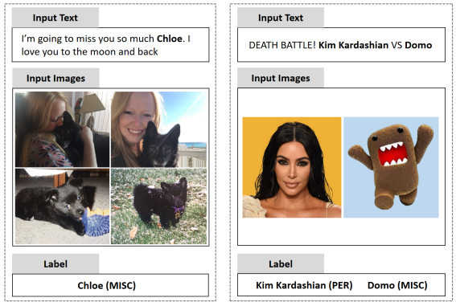
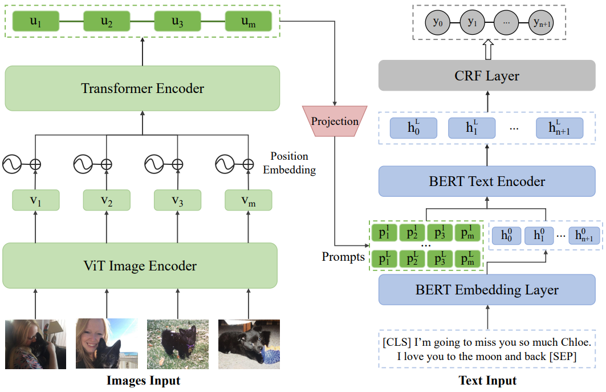

#  MNER-MI (Multimodal Named Entity Recognition with Multiple Images)
The pytorch implementation of "MNER-MI: A Multi-image Dataset for Multimodal Named Entity Recognition in Social Media" and publication of the **MNER-MI** dataset (**LREC-COLING 2024**).

**MNER-MI** is the abbreviation of MNER with Multi-Image, a MNER task with multi-image scenarios.

Note: The name of the dataset proposed in this paper is also **MNER-MI**.

The repository contains the dataset MNER-MI proposed in the paper as well as an implementation of the TPM-MI framework.

---
The examples of MNER-MI are shown in the following figure:



---

The framework of TPM-MI is shown in the following figure:




## Enviroment
We recommend the following actions to create the environment:
```bash
conda create -n  TPM-MI python==3.8.16
conda activate TPM-MI
pip install torch==1.7.1+cu110 torchvision==0.8.2+cu110 -f https://download.pytorch.org/whl/torch_stable.html
pip install transformers ==4.29.0
pip install pytorch-crf==0.7.2
pip install tokenizers ==0.13.3
```

## Dataset Download & Introduction

In this paper, we introduce a dataset called **MNER-MI**. 
We merge it with [Twitter-2017](https://github.com/jefferyYu/UMT) to get a dataset called **MNER-MI-Plus**.

These two datasets can be downloaded via Baidu Netdisk, and the download links are as follows：https://pan.baidu.com/s/1vUgRJZ54fxgSQDGXWsf6sg?pwd=tyvy 

After downloading, you need to unzip the downloaded files and place them in the `dataset` folder, and the file structure should appear as follows:
```bash
Dataset
|-- text
|    |-- MNER-MI_train.txt   # The training set of MNER-MI.
|    |-- MNER-MI_val.txt     # The validation set of MNER-MI.
|    |-- MNER-MI_test.txt    # The test set of MNER-MI.
|    |-- MNER-UNI_train.txt  # The training set of MNER-MI-Plus.
|    |-- MNER-UNI_val.txt    # The validation set of MNER-MI-Plus.
|    |-- MNER-UNI_test.txt   # The test set of MNER-MI-Plus.
|-- images.zip -> images (folder)
|-- twitter2017_images.zip -> twitter2017_images (folder)
```

The shared cloud files (Baidu Netdisk) include a folder named `text`, and two zip files named `images.zip` and `twitter2017_images.zip`.

The `images.zip` contains all the images from the MNER-MI dataset, while the `twitter2017_images.zip` contains all the images from the Twitter-2017 dataset.

The format of each instance in text file is as follows:
```bash
# MNER-MI dataset examples
{"id": 5302, "text": ["i", "have", "such", "a", "soft", "spot", "for", "jaebeom"], "images": ["5302_0.jpg", "5302_1.jpg"], "label": ["O", "O", "O", "O", "O", "O", "O", "B-PER"], "url": "https://twitter.com/i/web/status/1389292031688720386"}

# Twitter-2017 examples in MNER-MI-Plus
{"id": "twitter2017-O_538", "text": ["Ryan", "Newman", "NASCAR", "Endorses", "Donald", "Trump", "for", "President"], "images": ["twitter2017-O_538.jpg"], "label": ["B-PER", "I-PER", "B-ORG", "O", "B-PER", "I-PER", "O", "O"], "url": ""}
```

The instances from Twitter-2017 has been processed and converted into JSON format. 
The `id` represents the data identifier, `text` contains the words in text, `images` corresponds to the images associated with the instance, `label` represents the labels for each word/token in the text, and `url` refers to the original tweet link (not available in Twitter-2017).


## Required pre-trained models
In our paper, we use `BERT` and `VIT` as text encoder and image encoder, respectively.

For the code implementation, we utilized the models and weights provided by Hugging Face. 
Specifically, in lines 44 and 47 of the `run.py`, we downloaded the corresponding models (bert-base-uncased and ViTB-16) from the Hugging Face model repository to the local folders. 
The respective Hugging Face links are: https://huggingface.co/google-bert/bert-base-uncased and https://huggingface.co/google/vit-base-patch16-224.

## Running
After you have prepared the required enviroment, data, and models, you can run `python run.py` to train a model for MNER-MI.

If running with the `python run.py --dataset MI`, the training and testing will be performed on the **MNER-MI** dataset.
If running with the `python run.py --dataset UNI`, the training and testing will be performed on the **MNER-MI-Plus** dataset.


